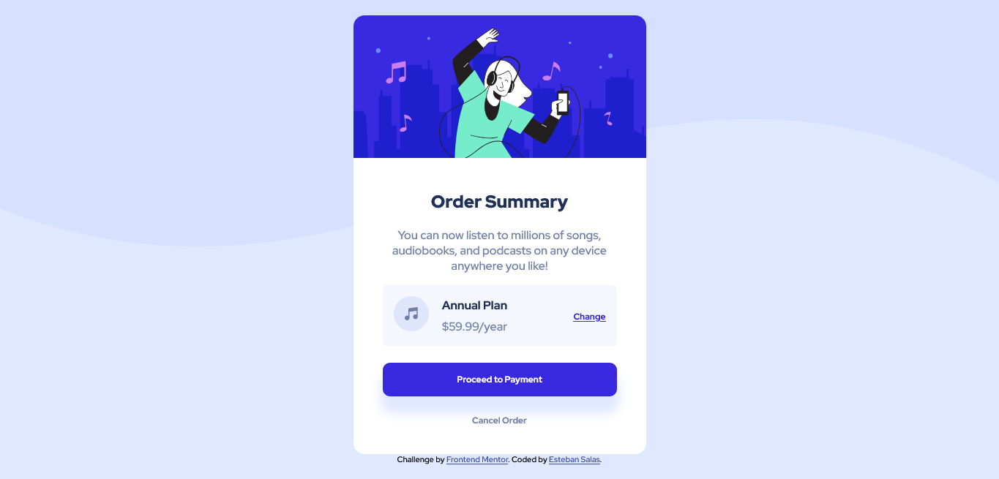

# Frontend Mentor - Order summary card solution

This is a solution to the [Order summary card challenge on Frontend Mentor](https://www.frontendmentor.io/challenges/order-summary-component-QlPmajDUj). Frontend Mentor challenges help you improve your coding skills by building realistic projects.

## Table of contents

- [Overview](#overview)
  - [The challenge](#the-challenge)
  - [Screenshot](#screenshot)
  - [Links](#links)
- [My process](#my-process)
  - [Built with](#built-with)
  - [What I learned](#what-i-learned)
  - [Continued development](#continued-development)
  - [Useful resources](#useful-resources)
- [Author](#author)

## Overview

### The challenge

Users should be able to:

- See hover states for interactive elements

### Screenshot



### Links

- Live Site URL: [https://geo0510.github.io/Order-summary-component/]

## My process

### Built with

- Semantic HTML5 markup
- CSS custom properties
- Flexbox

### What I learned

This challenge was great because it make me understand flexbox in many different ways
Also I improve my position knowlegde in css.

This part of my HTML was challenging:

```html
<section class="container_plan-anual">
  <div class="second_container-plan-anual">
    <div>
      
    </div>
    <div>
      <span class="plan_text Anual_plan-text font_strong">Annual Plan</span>
      <span class="color_text">$59.99/year</span>
    </div>
  </div>
  <div>
    <a href="#" class="btn_plan-change font_strong">Change</a>
  </div>
</section>
```

And these styles I feel the most proud of because i did myself and it make me understand how flexbox work obviously not everything of flexbox but it's really an improvement for me:

```css
.container_plan-anual {
  display: flex;
  justify-content: space-between;
  align-items: center;
  padding: 15px;
  border-radius: 5px;
  background-color: hsl(225, 100%, 98%);
}

.second_container-plan-anual {
  display: flex;
  justify-content: space-between;
  align-items: center;
  width: 60%;
}
```

### Continued development

I want more challenges with basic css, flexbox and soon I will enter the world of Grid. I'm really excited.

### Useful resources

- [A-guide-to-flexbox/](https://css-tricks.com/snippets/css/a-guide-to-flexbox/) - This helped me to see flexbox different and actually do son examples. I really liked it and I'll use it going forward.

## Author

- Frontend Mentor - [@Geo0510](https://www.frontendmentor.io/profile/Geo0510)
